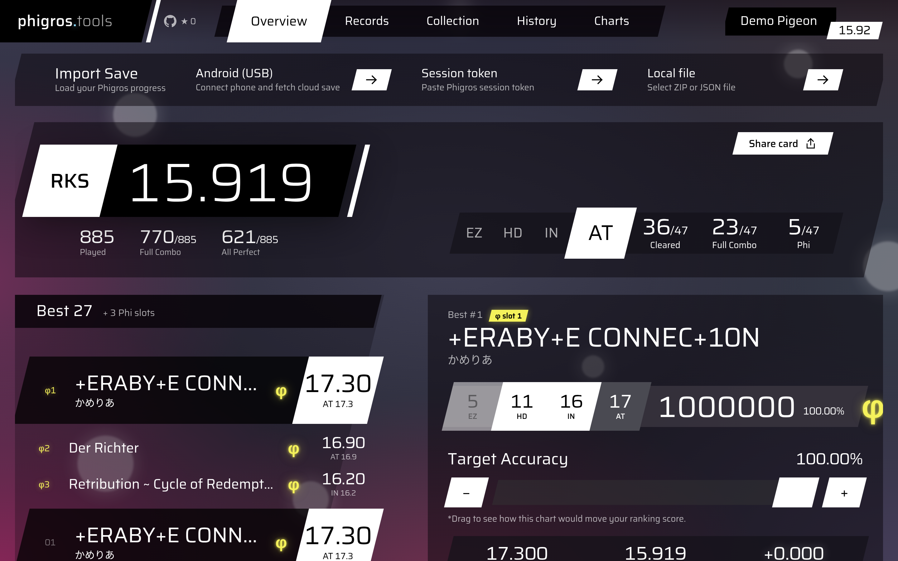
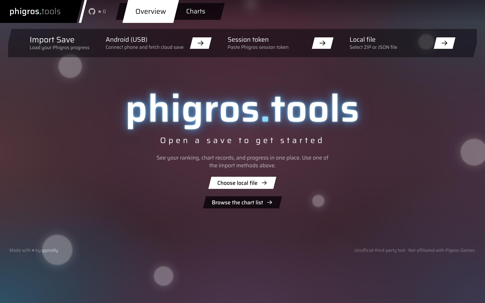
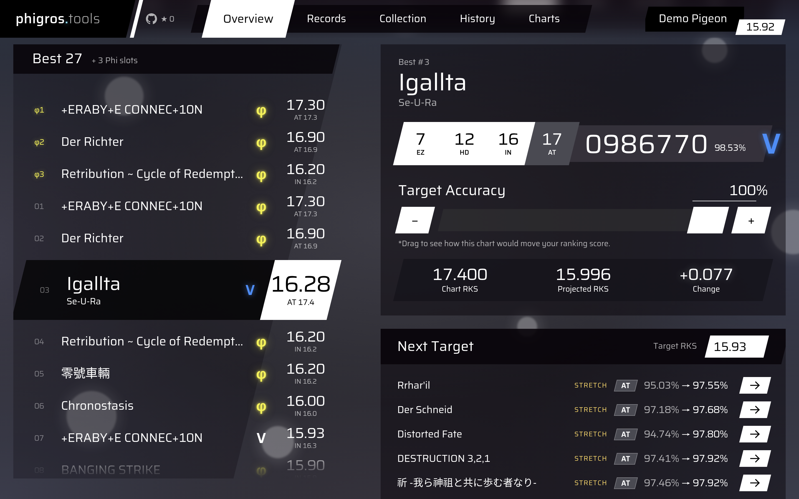
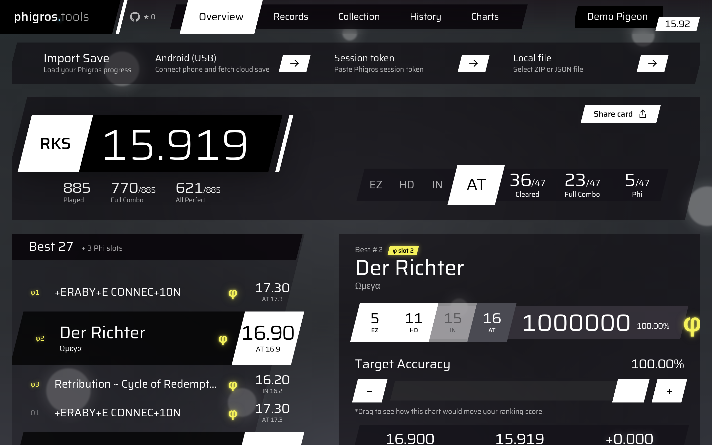
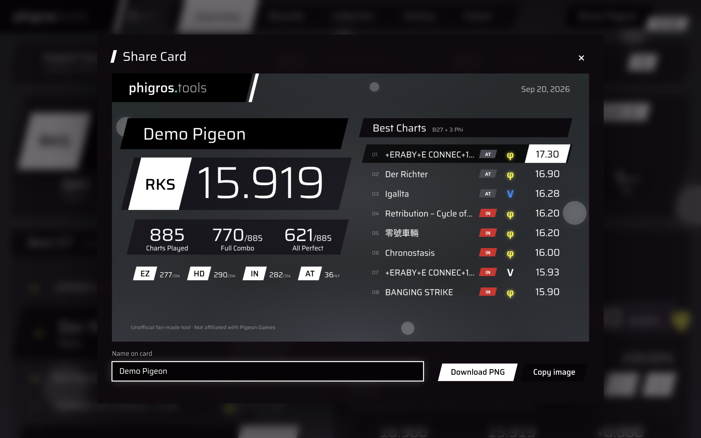
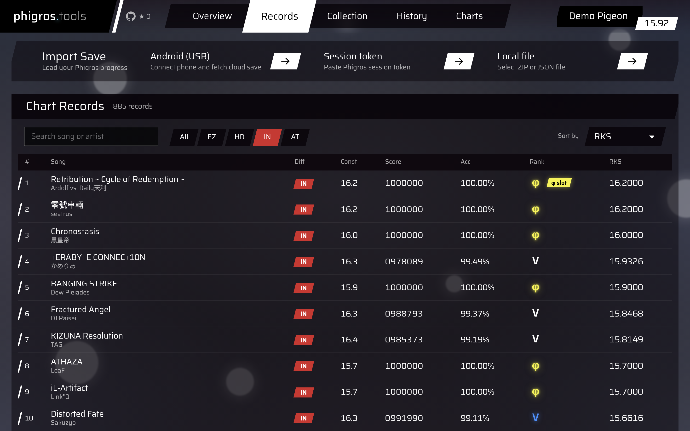
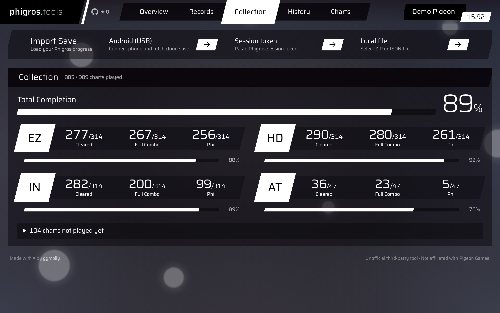
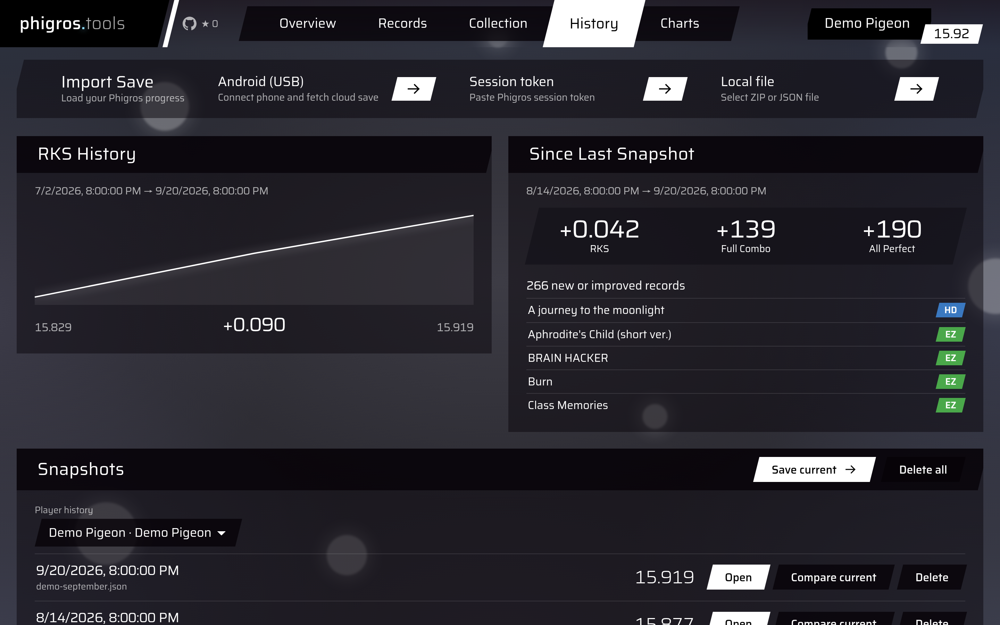
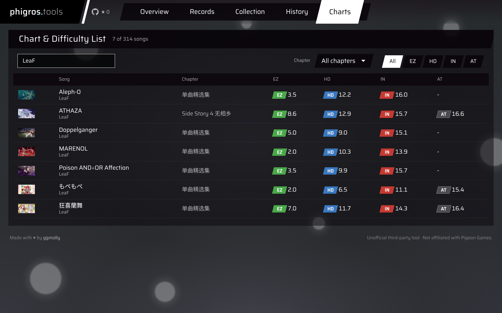
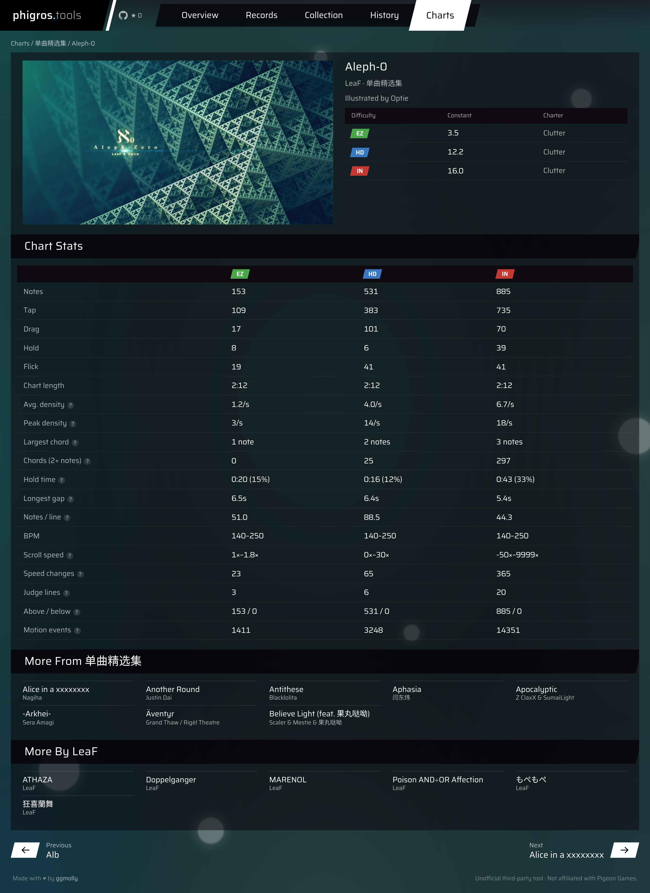

# phigros.tools

Analyze your Phigros save (ranking score, Best charts, records, progress) privately in your browser, and browse every chart's difficulty constant.



## Features

### Import a save

Connect an Android phone over USB, paste a session token, or open a ZIP/JSON save file.



### Overview

Your RKS, played / Full Combo / All Perfect counts per difficulty, Challenge Mode rank, Data and self-intro, and your Best 27 + 3 Phi slots. Pick a chart and drag its target accuracy to see how it would move your ranking score; **Next Target** lists the charts closest to raising it.



The background fog takes on the colours of the selected song's cover.



### Share card

A summary image of your RKS, counts and best charts, to download as PNG or copy.



### Records

Every chart you've played, searchable, filterable by difficulty and clear status (not FC, FC but not φ, φ), and sortable, including by how much an All Perfect would raise your RKS.



### Collection

Cleared, Full Combo and Phi progress per difficulty, plus the charts you haven't played yet.



### History

Save snapshots (stored in your browser) to chart your RKS over time and see what changed since the last one.



### Charts

The full chart list with difficulty constants, filterable by title, artist, illustrator, chapter and difficulty. No save needed.



Each song has its own page with your records on it when a save is loaded, charters, per-difficulty chart stats (note counts, density, BPM, scroll speed, judge lines…) and related songs.



Screenshots use a fictional demo save; regenerate them with `scripts/screenshots.ts` (see its header).

## Develop

```sh
bun install
bun run dev
```

Production: `bun run build && bun run start`.

## Data

Songs, constants, charters, chapters, covers and chart stats all come from the game's APK. To refresh after a game update:

```sh
cd ../extract && .venv/bin/python export_game_info.py   # song database -> game_info.json
cd ../web && bun scripts/build-catalog.ts ../extract/game_info.json
```

The export reads the APKs' `assets/bin/Data` unzipped into `../extract/game_data/` (see the script's header). The other `scripts/build-*.ts` regenerate chart stats, covers, avatars, palettes, accent colours and the sitemap; each file's header says what it reads.

## Credits

Saira font under the OFL, see `LICENSES/`.

Unofficial third-party tool · Not affiliated with Pigeon Games.
