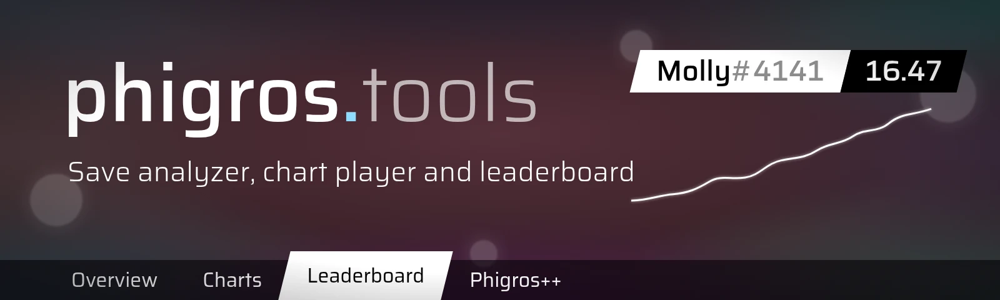
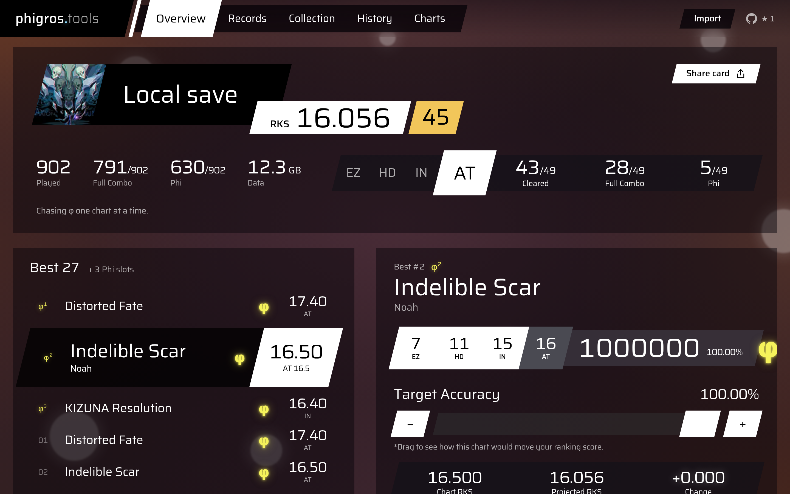
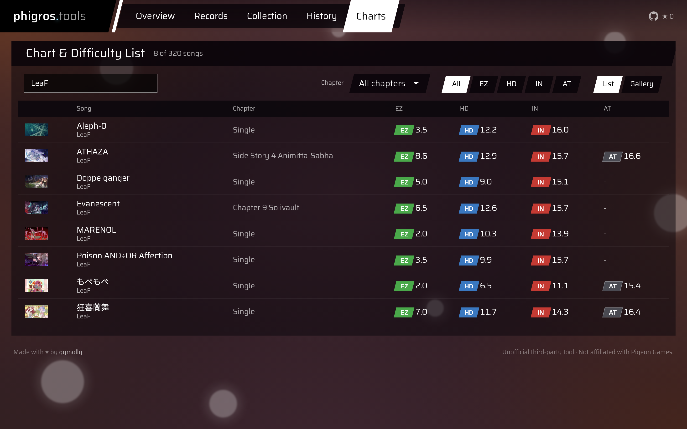
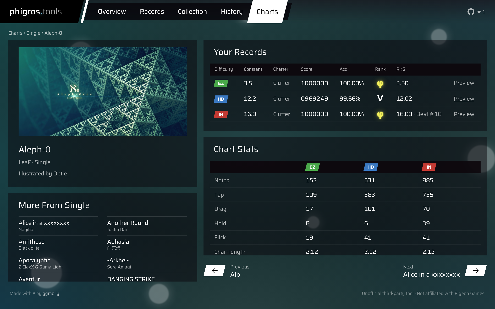
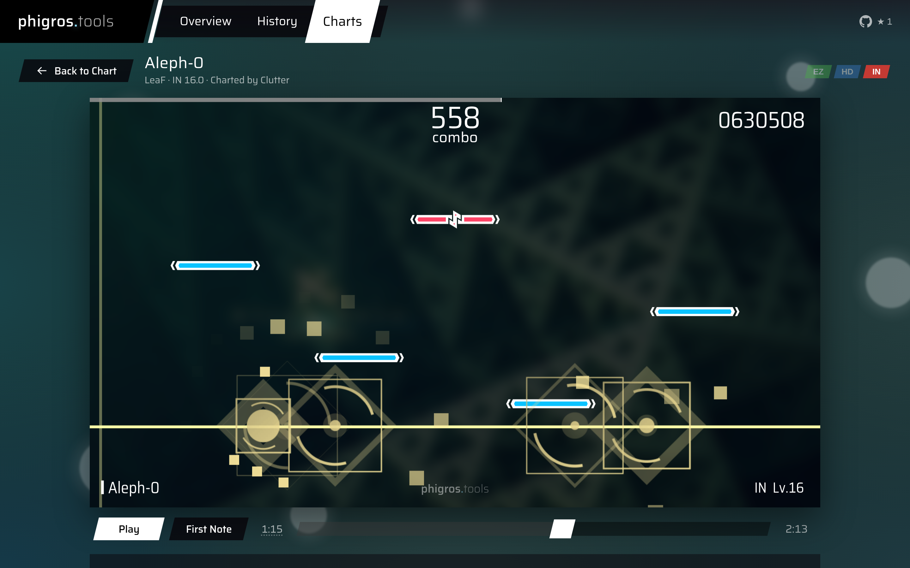

# phigros.tools



Analyze your Phigros save (ranking score, Best charts, records, progress) privately in your browser, and browse every chart's difficulty constant.


## Features

### Import a save

Sign in from [Phigros++](../mod) to open the save it uploads: the game shows a code to type here (or opens the site
already signed in), or type the profile's 16-word recovery phrase. The browser makes its own key for the profile,
listed in **Devices** with every phone signed in, each removable. **Friends** lists the profile's friends as the
game does, with who is online and what they play, and adds, accepts or removes them; another player's page offers the
same. A ZIP or JSON save file opens too, from a link under the home page's menu.

With no save open, the home page is Phigros++'s: a menu laid out like the game's own, with Phigros++ and the way to get
it, every player this browser remembers and the chart list, then what Phigros++ adds, each with its release note.

A save that only lives in this browser can be sent to Phigros++, which offers to load it at its next start.

A save that only lives in the game has no way out without root, so **Bring Your Save Over** (`/start`) asks where it
is and says what works there. Without root the save is rebuilt by hand (`/rebuild`): the scores as the game shows them
with the RKS they make, the profile, and what was unlocked, never Data. The browser then makes the profile and its 16
words, and Phigros++ loads the save once signed in to it. Typed scores are **Declared**: listed on the player's page
and counted nowhere until a play from the game matches or beats them.


### Overview

Your RKS, played / Full Combo / All Perfect counts per difficulty, Challenge Mode rank, Data and self-intro, and your Best 27 + 3 Phi slots. Pick a chart and drag its target accuracy to see how it would move your ranking score; **Next Target** lists the charts closest to raising it.


The background fog takes on the colours of the selected song's cover.



### Records

Every chart you've played, searchable, filterable by difficulty and clear status (not FC, FC but not φ, φ), and sortable, including by how much an All Perfect would raise your RKS.


### Charts

The full chart list with difficulty constants, filterable by title, artist, illustrator, chapter and difficulty. No save needed.



Each song has its own page with your records on it when a save is loaded, charters, per-difficulty chart stats (note counts, density, BPM, scroll speed, judge lines…) and related songs.



### Play a chart

Watch any chart play out right in the browser from its **Preview** link, no save needed: adjustable speed and hitsound volume, and an optional local audio file to sync against. Share a link to a specific moment and it opens right there.



### Leaderboard

Players who sync from the game with [Phigros++](../mod) are ranked by RKS, and every chart has its own ranking, counting
all plays or verified replays only. A player's page is their profile: global rank, play count and time, notes hit,
accuracy, RKS history, top plays (with what each adds to their RKS), the ranks their new bests took, and recent plays,
with a **Watch** link on each verified one: the chart plays back with their fingers and their real judgements, score and
combo.

Records the game declares are marked **Imported**. An uploaded replay counts once the worker has judged it with a port
of the game's judgement (`src/judge.ts`) and its touches give the result the game recorded: it's then **Verified**, and
replaces an imported record of the same score, so a player can prove their records by playing them again. A replay that
gives another result doesn't count.

A song played with Phigros++'s modifiers (Easy, Hard Rock, Half Time, Nightcore, Hidden, Flashlight, Sudden Death,
Perfect, Random) is no record of the game's, so its replay only counts on the chart's **Modifiers** ranking: a row for
a player's best with each set of modifiers, by the total they give the score (up to 1,409,444). `src/modifiers.ts` holds their rules, the same as the game's:
the worker judges such a replay with them, and the player shows it at its speed, with its drums, shuffled notes and
hidden ones.

Links to a player or a replay show a preview on Discord and other apps, coloured like the song's cover: the player's
card (their RKS, counts and best charts), or the replay's (score, rank, accuracy and judgements), both drawn by
`server/card.tsx`.

### Rooms

[Phigros++](../mod) plays multiplayer rooms through the site: everyone in a room plays the chart its host picks at the
same time, over one WebSocket per game (`server/rooms.ts`, which documents the protocol). **Rooms** lists the open
ones live, and a room's page shows its players (the host wears a crown), the chart they're on and everyone's score
while a match is played, with a link that opens the game in the room (`phigrospp://room/<id>`). Under it, the room's
recap: the standings over its matches, then every match with its players ranked. The recap stays once the room is
closed.

A room with a password shows its name and how many players are in it, nothing else: its matches aren't kept. Chat
only goes from the game to the games of the same room, the site never sees it.

Links to a room show a preview drawn by `server/card.tsx` like the others: the room's name over the ranking of its
latest match, on that chart's cover.

### Phigros++ for iPhone and iPad

**Phigros++** (`/phigrospp`) says how to install [Phigros++](../mod), and on iOS it patches the game into it: the
player chooses their decrypted IPA and the browser makes `Phigros++.ipa` from it without uploading anything. The
patcher is `src/ipa.ts`, the mod's `scripts/ipa.ts` copied as it is (copy it again when it changes there). It patches
with the latest release's `phigrospp.ios`, which the worker keeps in `data/ios/` (`server/ios.ts`) and the page only
uses once the release key's signature on it is checked (`src/release.ts`). The page shows what the patcher finds as it
goes: the game's version, the layout of its code, where it registers its methods, each one prepared for hooks and a
log.

Screenshots use a fictional demo save; regenerate them with `scripts/screenshots.ts` (see its header).

## Develop

```sh
bun install
bun run db   # PostgreSQL 18 in Docker, kept in data/pg
bun run dev
```

For replays to be judged, `bun run queue` (RabbitMQ in Docker) and `bun run worker` beside it. `bun run seed [players]`
adds 300 made-up players (or as many as asked) with records, plays and replays a bot played, a quarter of them claiming
a better result than their touches give: the worker verifies the others and leaves those unverified. It also makes
ggmolly, a save with every chart φ and everything unlocked, and prints the recovery phrase that signs in to it.

The tables are declared in `server/schema.ts` (Drizzle). After changing them, `bun run generate` writes the change to
`drizzle/` as SQL, which the server and the worker apply when they start.

Production: `bun run build && bun run start`, with the replay worker beside it: `bun .output/worker.mjs`. They share
`data/`, a PostgreSQL database (`DATABASE_URL`, `postgres://phigros@localhost/phigros` by default) and a RabbitMQ
queue (`AMQP_URL`, `amqp://localhost` by default), and the game's data in `GAME_DIR` (`./data/game`, see Data).

Both write one JSON line per event to stdout (`server/log.ts`): each request with its route, status and duration, what
happens in rooms and between friends, the replays judged, and the errors pages report. A line names a signed-in
player by their public id at most, never an address, a request's body, a key, a password or a chat line. With
`LOGS_URL` naming a [VictoriaLogs](https://docs.victoriametrics.com/victorialogs/), the lines are kept there, 90 days
on phigros.tools.

## Release notes

`/releases` shows what each release of Phigros++ and each update of the site brought. A note is `releases/<slug>.md`
(the slug in `a-z`, `0-9` and `-`) with what it shows beside it in `releases/<slug>/`: small images, or a short video
or GIF. It starts with its date and, for a release of Phigros++, that version, then its title:

```md
---
date: 2026-11-23
phigrospp: 0.3.0
---
# Its title

How it starts, which the feed, link previews and Discord show.


## A section


```

It's read like a mod's README (`server/readme.ts`): headings, paragraphs, lists, quotes, code and media. Its first
image is what the feed, link previews and Discord show, so it's an illustration and not a screenshot: an SVG whose
images name files of the game by their path here (`data/game/covers/...`, `data/game/avatars/...`,
`public/player/...`) and whose text is drawn in the game's lettering.
`bun scripts/build-releases.ts` builds every note into `src/releases.json` and `public/releases/`. A note written ahead
for a release of Phigros++ only shows once that release is out. The worker then posts the newest note Discord hasn't
seen to the webhook `discord_releases` of `data/config.toml`, once: what it posted is kept in `data/releases/`, so a
deploy without a new note posts nothing.

## Data

Songs, constants, charters, chapters, covers, music, charts and avatars all come from the game's APK and aren't in
this repository: they live in `data/game/` (`server/game.ts`), so a game update reaches the site without a deploy. An
updater made from the APK on Google Play keeps it on the latest build; the server and the worker load each version it
publishes within 30 seconds, and the browser gets what it needs of it from `/game.json` (`src/client.tsx`).

## Credits

Saira, Noto Sans SC and Noto Sans Armenian fonts under the OFL, DejaVu Sans under its own license, see `LICENSES/`. The player cards use subsets of all four.

Unofficial third-party tool · Not affiliated with Pigeon Games.
